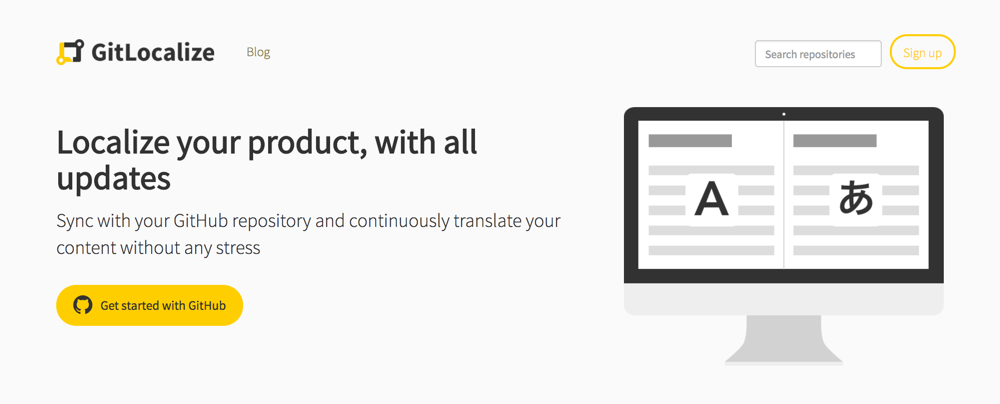
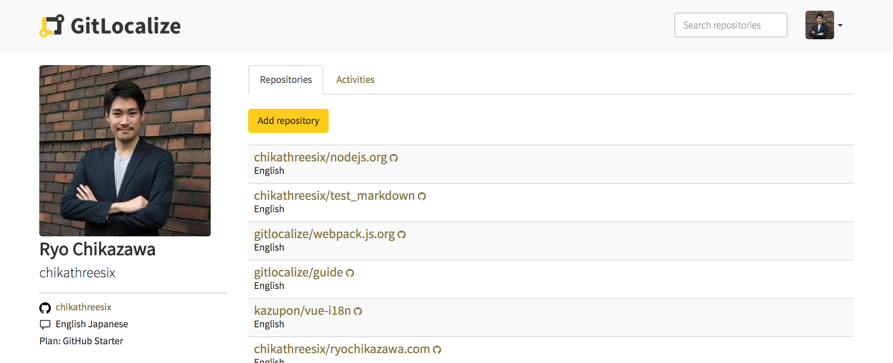
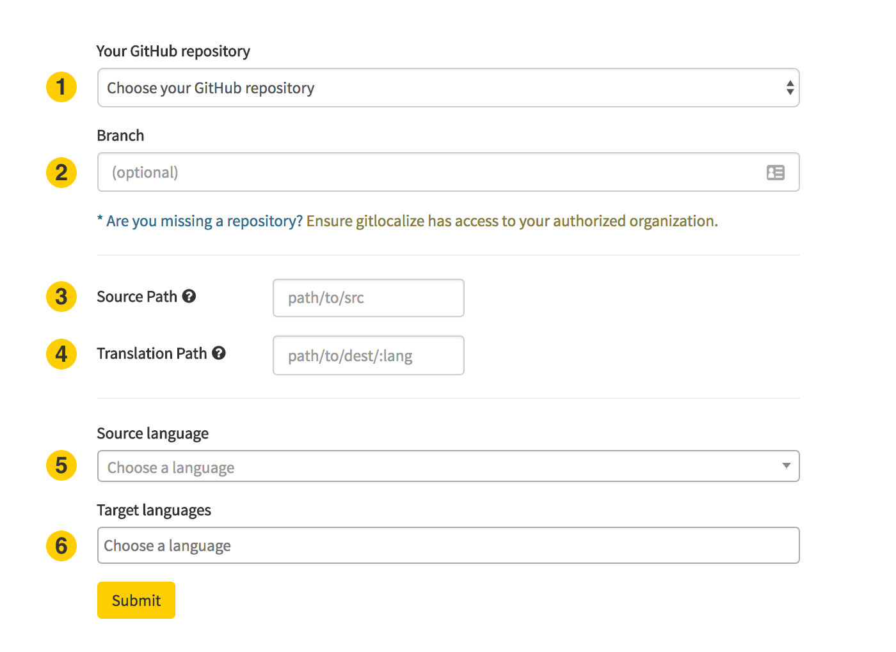

# Getting Started

Integrating your repository with GitLocalize only takes a few minutes!

## Signing up to GitLocalize

First, go to [gitlocalize.com](https://gitlocalize.com) and sign up with your GitHub account.

Click either the "Sign up" button at the top right or the "Get started with GitHub" button on the left. Next, you will be prompted to authorize your account with our OAuth app.

## Add Repository

Once you sign up, click the `Add repository` button from your page.

Fill in the form to configure your repository environment.

1. Select your repository that you want to localize.
2. Select your branch (default: master).
3. Path of the directory that has the files you want to localize.
4. Path of the directory where GitLocalize generates translation files.
5. Language of the source files.
6. Languages you want to localize to.

## Translate

After integrating, GitLocalize pulls the target files to the platform. The amount of time this takes will depend on the size of your repository.

Once GitLocalize finishes pulling the files, you can start translating your files with the split-view editor. This editor links the translation to the original file line-for-line and highlights the parts that still need to be translated.

## Review

After translating the file, click the `Create Review Request` button next to the status icon. This button notifies your team that you are done and allows you to discuss the updates as you would normally do with a pull request.

## Pull Request

Once your team is satisfied with your revisions, the language moderator can send a pull request back to the repository.
