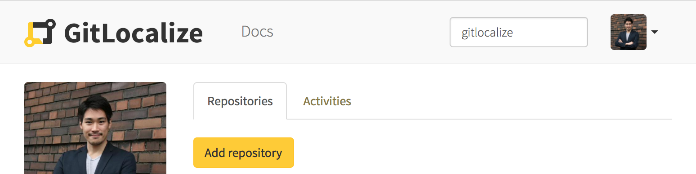
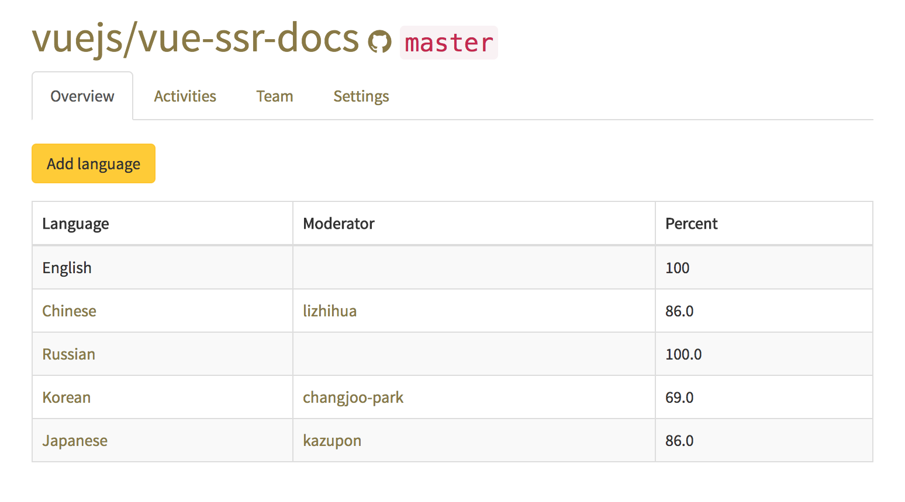
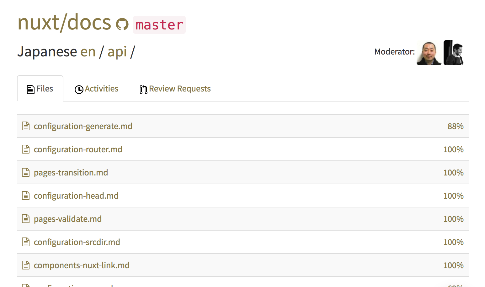
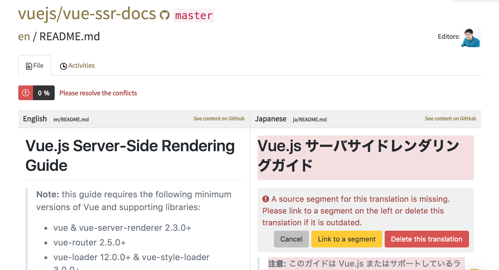
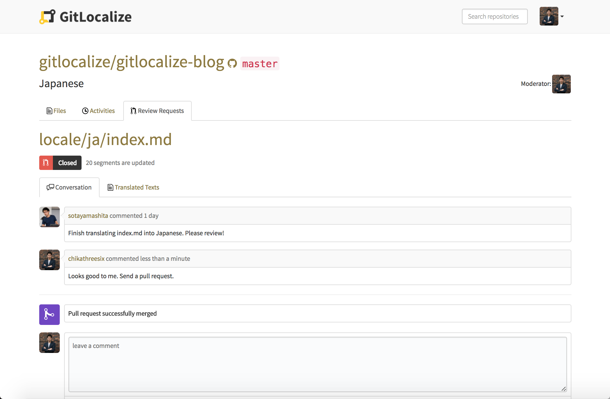

# How to Contribute to Projects

Do you want to contribute to projects on GitLocalize, but you don't know how to? Follow these simple steps, and you'll be contributing in no time! 

## 1. Find a Project

Of course, in order to contribute to a project, first you must find a project to contribute to! 

If you don't have a project of your own, try using the top search bar to filter projects by keywords related to your interests. You can also check out the home page to see [popular projects](https://gitlocalize.com).

## 2. Choose a Language

Once you've found a project you'd like to work on, navigate to its page. 

Here, you'll see a list of active languages to translate the project to. The middle column shows the moderator of each translation. The rightmost column tells you how much of the project has been translated to that language already.

Simply choose the language that you'd like to help with translating the project to. Don't see your language? Add it using the `Add language` button!

## 3. Navigate to a File

Once you've selected your language, navigate to the file that you'd like to translate. Similar to the last step, the rightmost column tells you how much of each file has been translated already. 

## 4. Translate

Now for the fun part! After selecting a file, simply click on a segment on the right side (translation side) that corresponds with the left side (original language side). 

Fill in your translation on the right side and submit it!

## 5. Resolve a Conflict

If a translated file is very outdated when compared to the original file, some segments may not have a linked counterpart. GitLocalize will show this as a conflict. 

When this happens, you'll have two options: you can link the translation segment on the right to the original on the left, or you can delete the translation segment.

## 6. Review Request & Pull Request

After you finish translating a file, the `Create Review Request` button will appear at the top of the page. Click it to create a review request. This will notify your team that you're done translating and will start a discussion about your changes. 

You can check out the 'Conversation' tab under the 'Review Requests' section to see if you received any feedback on your work.

Once the moderator thinks your translation is good to go, he or she will send a pull request to the repo. Congratulations! You've successfully made a contribution to a project!

