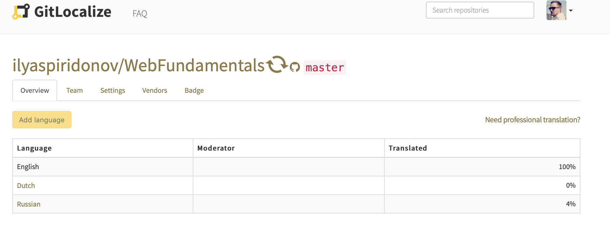

# Why does my project take forever to sync?

Sometimes you'll see that there's a spinner beside the name of your project:

This means that your project is currently syncing. Sometimes you may find that this is taking too long, especially in the following cases:
- this is an initial sync (i.e. you've just added the project);
- there are a lot of files in the GitHub repository;
- you have a lot of languages in the project.

GitLocalize uses GitHub Apps and GitHub API to connect and sync with your GitHub repository. GitHub uses API rate limiting, which means we can not send more than 5000 API calls per hour per project. So sometimes we will not be able to finish the sync at once, and GitLocalize will have to wait another hour to complete the sync.

Please allow a few hours for initial sync to complete. If you still believe something's wrong (the sync has been going for several hours or days), please contact us via the chat widget on your right or via the [contact form](https://gitlocalize.com/inquiries/new)
